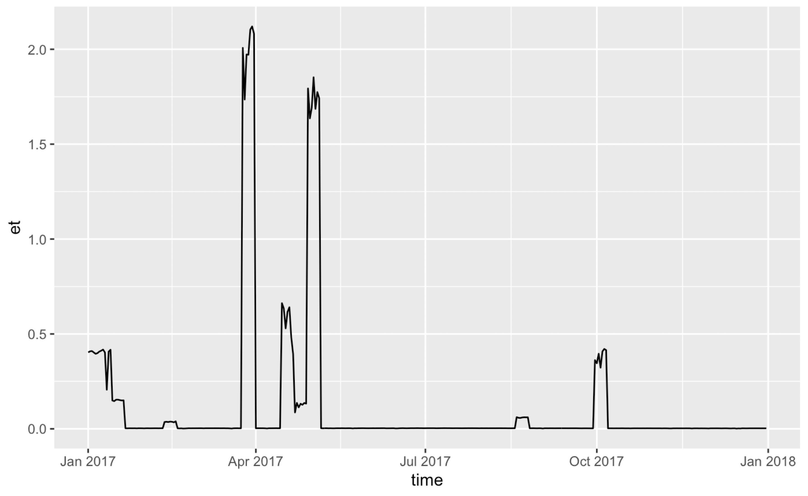

## The problem

Geospatial data often has a time dimension. Such temporal geospatial data often comes in the form of multiple files that contain the data of a single time step - in the form of a geospatial map - or in the form of files that each contain the data of a subset of the time steps. This is a problem for analyses and modelling that rely on having access to the whole time series data. To obtain the whole time series, we have to read all files into memory and then run the analyses. In practice, this is often not possible due to memory limitations. What can we do? 

We have to open each file, read a subset of the data, close the file, and open the next one and "stitch" the data together along the time axis. Then, repeat this to read the remaining subsets of the data to finally have time series of all geospatial units (usually pixels). This creates a burdensome computational overhead and involves lots of programming. Especially if the analyses are to be carried out in parallel for the spatial units.

The [{map2tidy}](https://geco-bern.github.io/map2tidy/) R package solves this problem.

## The solution

The function `map2tidy` of our [{map2tidy}](https://geco-bern.github.io/map2tidy/) R package takes a vector of file names (full paths) of NetCDF files containing geospatial data and returns a tidy data frame where each row represents one pixel of the geospatial (raster) data and the complete time series of each pixel is contained as a nested data frame in the column `data`. This is solved in R with the code below.

```r
library(map2tidy)
library(dplyr)
library(ggplot2)

# list demo file path
path <- file.path(system.file(package = "map2tidy"),"extdata")

# list demo files
files <- list.files(path, pattern = "demo_data_2017_month", full.names = TRUE)

# load and convert
df <- map2tidy(
  nclist = files, 
  varnam = "et",
  lonnam = "lon", 
  latnam = "lat", 
  timenam = "time", 
  timedimnam = "time"
  )
```

```r
head(df)
```

The complete time series are now nested data frames in column `data`. We can plot them.
```r
df$data[[1]] |> 
  ggplot(aes(time, et)) +
  geom_line()
```


### Large files

When handling large files, having the complete data frame returned should be avoided to avoid memory overload. Write chunks of the data to separate files, placed in a directory as specified by the argument `outdir` with file names specified by argument `fileprefix`. The chunks will be along longitudinal bands (single index in longitude, all indices in latitude).
```r
map2tidy(
  nclist = files, 
  varnam = "et",
  lonnam = "lon", 
  latnam = "lat", 
  timenam = "time", 
  timedimnam = "time",
  outdir = tempdir(), 
  fileprefix = "demo_data_2017", 
  overwrite = TRUE
  )
```

### Parallelisation

This process can be parallelised by setting the argument `ncores = 3` (or to another suitable number of cores).
```r
map2tidy(
  nclist = files, 
  varnam = "et",
  lonnam = "lon", 
  latnam = "lat", 
  timenam = "time", 
  timedimnam = "time",
  outdir = tempdir(), 
  fileprefix = "demo_data_2017", 
  ncores = 3,
  overwrite = TRUE
  )
```
